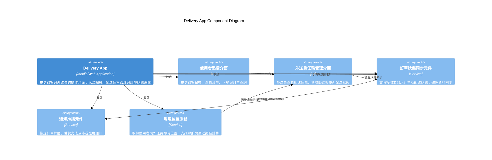

# Delivery App Component Diagram

---

## 使用場景

- 外送員透過 App 接收配送任務、導航與更新配送狀態。
- 需確保外送員操作流暢，並即時同步配送資訊。

## Delivery App (外送員與使用者端應用)

負責提供顧客與外送員操作介面，包含點餐、訂單查詢、外送進度追蹤及外送任務管理，是系統與使用者互動的前端入口。

| 元件名稱                           | 功能說明                                                               |
| ---------------------------------- | ---------------------------------------------------------------------- |
| 使用者點餐介面 User Ordering UI    | 提供顧客點餐、查看菜單、建立訂單及訂單狀態查詢的前端介面（App 或網頁） |
| 外送員任務管理介面 Courier Task UI | 外送員查看配送任務、導航路線、更新配送狀態的操作介面                   |
| 訂單狀態同步元件 Order Status Sync | 實時接收並顯示訂單及外送狀態，確保使用者端與外送員端資料同步更新       |
| 通知推播元件 Notification Push     | 負責推送訂單狀態變更、備餐完成、外送進度等通知給使用者與外送員         |
| 地理位置服務 Location Service      | 取得使用者與外送員的即時位置，支援路徑導航與最近餐廳據點計算           |

## 目標

- 提供穩定且低延遲的配送任務接收與導航服務。
- 確保配送狀態能及時反映給核心系統與用戶端。
- 支援多種手機平台，保持高可用性。

### 建議 SLO

| 指標           | 目標值             | 備註                     |
| -------------- | ------------------ | ------------------------ |
| 任務接收成功率 | ≥ 99.9%           | 外送員能即時收到配送任務 |
| 導航系統可用率 | ≥ 99.9%           | 導航功能不中斷           |
| 狀態更新延遲   | 95% 狀態更新 < 3秒 | 確保配送狀態即時反映     |
| 系統可用率     | ≥ 99.9%           | 保持 App 穩定運行        |
