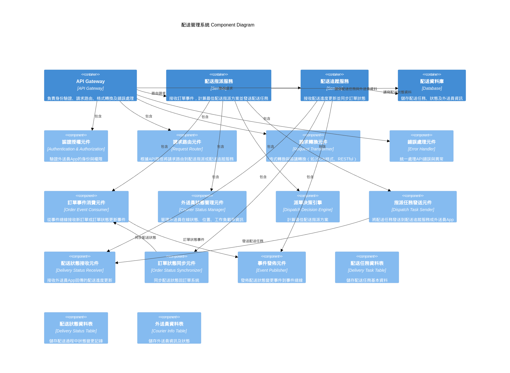

# Delivery Management System Component Diagram
----

##  配送指派服務 (Delivery Dispatcher Service) 

| 元件名稱 |	功能說明 |
| ----- | -------- | 
| 訂單事件消費元件 Order Event Consumer |	從事件總線接收新訂單或訂單狀態更新事件 |
| 外送員狀態管理元件 Courier Status Manager |	管理外送員在線狀態、位置、工作負載等資訊 |
| 派單決策引擎 Dispatch Decision Engine |	根據訂單需求及外送員狀態，計算最佳配送指派方案 |
| 指派任務發送元件 Dispatch Task Sender |	將配送任務發送到配送追蹤服務或外送員App |

## 配送追蹤服務 (Delivery Tracking Service) 

| 元件名稱 |	功能說明 |
| ----- | -------- | 
| 配送狀態接收元件 Delivery Status Receiver |	接收外送員App或設備回傳的配送進度更新 |
| 訂單狀態同步元件 Order Status Synchronizer |	將配送狀態更新同步回訂單系統，更新訂單狀態 |
| 事件發佈元件 Event Publisher |	發佈配送狀態變更事件到事件總線，通知其他系統 |

##  配送資料庫 (Delivery Database)

| 元件名稱 |	功能說明 |
| ----- | -------- | 
| 配送任務資料表 Delivery Task Table |	儲存配送任務基本資料（訂單ID、外送員ID、指派時間等） |
| 配送狀態資料表 Delivery Status Table |	儲存配送過程中狀態變更記錄 |
| 外送員資料表 Courier Info Table |	儲存外送員資訊及狀態 |

## API Gateway 元件圖

| 元件名稱 |	功能說明 |
| ----- | -------- | 
| 認證授權元件 Authentication & Authorization |	驗證外送員App的身份與權限 |
| 請求路由元件 Request Router |	根據API路徑將請求路由到配送指派或配送追蹤服務 |
| 請求轉換元件 Request Transformer |	格式轉換與協議轉換（如JSON格式、RESTful） |
| 錯誤處理元件 Error Handler |	統一處理API錯誤與異常 |