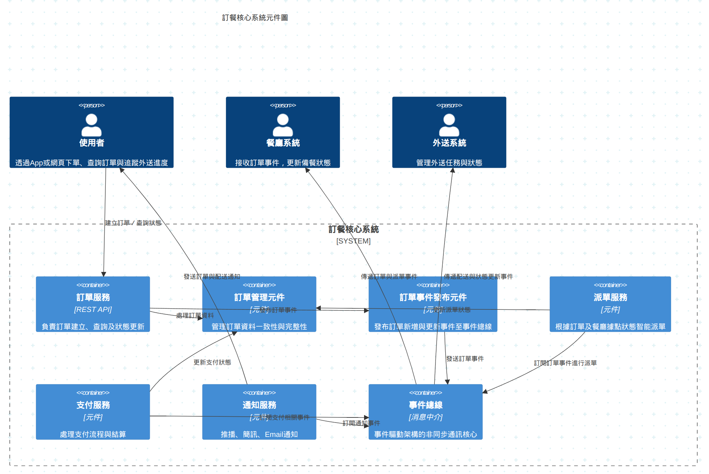

# Order Core System Component Diagram
----

## 使用場景
- 負責訂單資料管理，包括訂單建立、狀態更新與查詢。
- 為上下游系統（餐廳系統、外送系統）提供訂單事件及狀態同步服務。

## 訂單服務 (OrderService)
負責訂單的建立、查詢與狀態更新，是系統核心資料來源。

| 元件名稱 |	功能說明 |
| ----- | -------- | 
| 訂單管理元件 Order Management Component |	負責訂單的建立、查詢與狀態更新，是系統核心資料來源，確保訂單資料一致性與完整性。 |
| 訂單事件發布元件 Order Event Publisher |	將訂單的新增、修改等事件發布到事件總線，供其他服務訂閱與處理。 |

## 派單服務 (DispatchService)
根據訂單資訊與餐廳據點狀態，智能分配訂單給距離最近的餐廳。

| 元件名稱 |	功能說明 |
| ----- | -------- | 
| 訂單事件消費元件 Order Event Consumer | 	從事件總線接收新訂單或訂單狀態更新事件，觸發派單流程。 | 
| 派單決策引擎 Dispatch Decision Engine | 	根據訂單資訊與餐廳據點狀態，計算最佳配送指派方案，智能分配訂單給距離最近且可接單的餐廳。 | 
| 指派任務發送元件 Dispatch Task Sender | 	將派單結果同步發送給餐廳據點系統，確保訂單準確送達餐廳。 | 

## 支付服務 (PaymentService)
處理支付流程與結算，確保訂單支付狀態正確。

| 元件名稱 |	功能說明 |
| ----- | -------- | 
| 支付處理元件 Payment Processing Component | 	處理使用者支付流程，與第三方支付平台串接完成交易。 | 
| 支付狀態同步元件 Payment Status Synchronizer | 	將支付結果回傳訂單服務，更新訂單支付狀態，確保交易流程完整。 | 

## 通知服務 (NotificationService)
發送訂單狀態相關通知給使用者，包括推播、簡訊與Email。

| 元件名稱 |	功能說明 |
| ----- | -------- | 
| 通知發送元件 Notification Sender |	根據訂單狀態變更，發送推播、簡訊及Email通知給使用者，提高用戶體驗。 |
| 通知管理元件 Notification Manager |	管理通知模板與發送紀錄，確保通知內容正確且及時。 |

## 事件總線 (EventBus)
作為系統內部事件的發布與訂閱平台，支援非同步通訊。

| 元件名稱 |	功能說明 |
| ----- | -------- | 
| 事件發布元件 Event Publisher | 	負責將系統內部的訂單事件、支付事件等發布到事件總線。 | 
| 事件訂閱元件 Event Subscriber | 	各服務訂閱事件總線上的事件，實現系統間非同步通訊與鬆耦合。 | 

## 庫存管理服務 (InventoryService)
管理菜單資訊及庫存狀態，防止超賣。

| 元件名稱 |	功能說明 |
| ----- | -------- |
| 庫存查詢元件 Inventory Query Component | 	提供菜單及庫存狀態查詢，防止超賣。 | 
| 庫存更新元件 Inventory Update Component | 	根據訂單狀態變更，及時更新庫存數量，保持庫存資料一致。 | 

## 目標
- 確保訂單資料完整、一致且無遺失。
- 高效處理訂單請求，避免積壓。
- 快速推送訂單事件，支持下游系統即時反應。
- 保持高可用性，避免系統中斷影響訂單流程。

### 建議 SLO
| 指標 |	目標值 |	備註 |
| ----- | -------- | -------- |
| 訂單處理成功率 |	≥ 99.99% |	訂單建立與狀態更新成功率 |
| 訂單事件發布延遲 |	99% 事件 < 500ms |	支持即時事件通知 |
| 訂單查詢回應時間 |	95% 請求 < 200ms |	快速查詢訂單狀態 |
| 系統可用率 |	≥ 99.99% |	高可用性保障 |