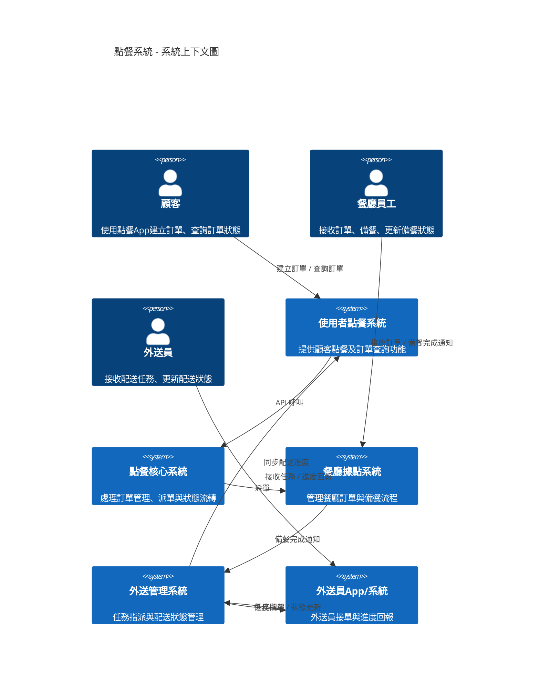

Delivery System Design
---

# 題目
```
請設計一個前後端架構的連鎖餐廳點餐外送系統，
● 使用者可在任何地方透過點餐系統點餐送單，上傳至點餐核心系統。
● 核心系統收單後自動派送至距離使用者最近的餐廳據點備餐。
● 備餐完成後透過待送餐點系統提供內部外送員外送資訊、取單確定外
送功能。
● 開始外送時於外送系統顯示外送路徑與餐點資料
● 使用者端同步顯示外送員外送進度
● 資料於外送系統餐點送達後結束。
設計內容包含此系統整體架構、後端程式功能模組拆分，你認為會使用到
的所有類型Service、資料交換方式，並說明你的設計理由，可用任何型式
表示。
```

## 設計理由說明
### 1. 採用 C4 Model 表示系統架構的原因
在軟體架構的溝通與說明上，UML 雖然功能強大，但種類繁多且細節複雜，往往不易快速讓所有利害關係人（如業務、開發、測試、管理者）理解。

相較之下，C4 Model 以簡潔清晰的四層結構（Context、Container、Component、Code）逐步拆解系統，使用簡單的方框與箭頭表示系統、子系統及元件間的關係，具備以下優點：

- **易於理解**：圖形簡單直觀，利害關係人能快速掌握系統整體架構與各部分功能。
- **分層清晰**：由粗到細分層呈現，方便逐步深入探討系統細節。
- **促進溝通**：統一架構語言，促進跨部門協作與共識。
- **適合敏捷開發**：內容以 Mermaid 語法能板控，快速繪製與更新，支持迭代式設計與調整。

因此，我們選擇 C4 Model 作為本次連鎖餐廳點餐外送系統的架構表示方式，讓各角色能清楚理解系統的功能分工與互動流程。

### 2. 系統設計理念與架構說明
設計基於「模組化」、「事件驅動」與「分層解耦」原則，主要考量包括：

**(1) 模組化分層設計**
將系統拆分成多個子系統與元件，如「使用者訂餐系統」、「訂餐核心系統」、「餐廳系統」、「外送管理系統」與「外送員 App」，每個子系統專注於特定職責，利於維護與擴展。
各子系統內部再細分元件，明確界定功能範圍與責任，提升系統可測試性與可重用性。

**(2) 事件驅動架構**
利用「事件總線」作為系統間非同步通訊的核心，訂單狀態、派單、支付、通知等事件透過事件總線發布與訂閱，實現鬆耦合。
事件驅動能提升系統彈性（消峰作用）與擴展性，方便新增功能或接入第三方系統，並降低系統間依賴。

**(3) 智能派單與狀態同步**
派單服務根據訂單需求與外送員狀態，智能選擇最合適的外送員，提高配送效率與顧客滿意度。
各系統間透過事件保持訂單與配送狀態同步，確保資訊即時且一致，提升用戶體驗。

**(4) 使用者體驗優先**
使用者訂餐系統與外送員 App 強調操作流暢與即時反饋，確保訂單快速送達且配送狀態透明。
通知服務負責多渠道通知，讓使用者與外送員隨時掌握訂單進度。


# 根據 C4 Model 梳理
## System Context Diagram
1. 角色（Person）
主要角色

| 角色	| 說明 |
| ----- | -------- |
| 使用者	| 一般顧客，透過前端系統（App/網頁）建立訂單、查詢訂單、追蹤外送進度 |
| 餐廳員工 |	負責備餐，接收訂單、確認備餐、通知外送員取單 |
| 外送員 |	餐廳內部外送人員，負責取餐、配送、更新外送狀態 |
| 系統管理員 | 後台管理，維護餐廳據點、菜單、帳號管理（可選，非主要流程） |

1. 系統（Software System）
主要系統

| 系統名稱	| 說明 |
| ----- | -------- |
| 使用者點餐系統	| 前端App/網頁，供顧客點餐、查詢、追蹤外送進度 |
| 點餐核心系統	| 負責訂單管理、智能派單、狀態協調、支付結算及通知管理 |
| 餐廳據點系統	| 各餐廳據點接收訂單、通知備餐完成、通知外送員 |
| 外送管理系統	| 管理外送員、指派外送、追蹤外送進度、回報送達 |
| 外送員App/系統	| 外送員端App/介面，查看外送任務、導航、更新狀態 |

其他輔助系統（可選）
- 通知服務（推播/簡訊/Email等）
- 地理定位服務（計算距離、路徑導航）
- 支付系統（金流串接）

```
[顧客] --建立訂單/查詢--> [使用者點餐系統] --API--> [點餐核心系統]
[點餐核心系統] --派單--> [餐廳據點系統]
[餐廳員工] --接收訂單/備餐完成通知--> [餐廳據點系統]
[餐廳據點系統] --備餐完成通知--> [外送管理系統]
[外送管理系統] --任務指派/狀態更新--> [外送員App/系統]
[外送員] --接收任務/進度回報--> [外送員App/系統]
[外送員App/系統] --進度回報--> [外送管理系統] --同步進度--> [使用者點餐系統]
```




## Container Diagram
### 使用者點餐系統 User Ordering System

| 容器名稱 | 	技術或類型 | 	職責說明 |
| ----- | -------- | -------- |
| Web App |	React/Vue |	提供網頁介面給顧客點餐與查詢訂單 |
| Mobile App |	iOS/Android |	手機App介面，提供點餐與訂單追蹤 |
| API Gateway |	REST API |	接收前端請求，轉發給點餐核心系統 |
| Notification Client |	Push Notification |	接收並顯示訂單狀態推播 |


### 點餐核心系統 Order Core System

| 容器名稱 | 	技術或類型 | 	職責說明 |
| ----- | -------- | -------- |
| 訂單API	REST API |	提供訂單接收、查詢與修改功能 |
| 訂單服務 | C# |	處理訂單業務邏輯，管理訂單生命周期 |
| 派單服務 | 微服務 |	智能派單，根據餐廳狀態分配訂單 |
| 支付服務 | 第三方支付整合 |	處理支付及結算 |
| 通知服務 | 事件驅動 |	推送訂單狀態更新通知 |
| 訂單資料庫 |	RDBMS |	存儲訂單及狀態資料 |


### 餐廳據點系統 Restaurant System

| 容器名稱	| 技術或類型	| 職責說明 |
| ----- | -------- | -------- |
| 訂單接收模組 |	桌面App/Web |	接收並顯示訂單給餐廳員工 |
| 備餐顯示系統 |	專用顯示裝置 |	顯示備餐進度及狀態 |
| 狀態更新服務 |	REST API |	將備餐狀態回報點餐核心系統及外送管理系統 |
| 餐廳訂單資料庫 |	關聯式資料庫 |	儲存訂單及備餐狀態 |


### 外送管理系統 Delivery Management System

| 容器名稱 |	技術或類型 |	職責說明 |
| ----- | -------- | -------- |
| 配送指派服務 |	微服務（事件消費者） |	根據訂單與外送員狀態指派配送任務 |
| 配送追蹤服務 |	事件驅動 |	追蹤外送進度並更新訂單狀態 |
| 配送資料庫 |	RDBMS |	儲存配送任務與狀態 |
| API Gateway |	REST API |	提供外送員App與其他系統介接 |


[Component diagram](./Delivery_management_system_component.md)

### 外送員App/系統 Delivery App/System

| 容器名稱 |	技術或類型 |	職責說明 |
| ----- | -------- | -------- |
| 外送員手機App |	iOS/Android |	查看任務、導航、更新配送狀態 |
| API 客戶端 |	REST Client |	與外送管理系統API通訊 |
| 通知客戶端 |	Push Notification |	接收配送任務與狀態推播 |


