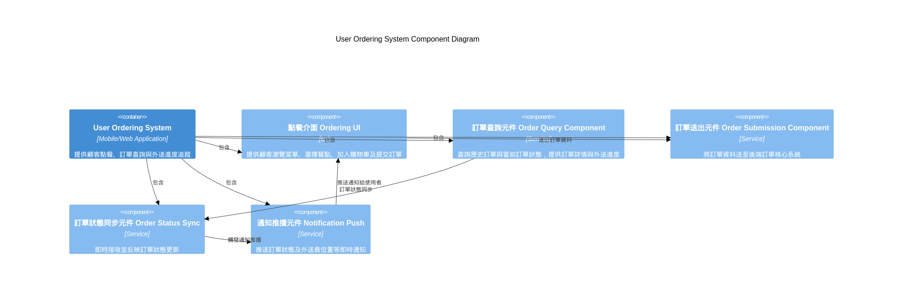

# User Ordering System Component Diagram

---

## 使用場景

- 使用者透過手機或網頁端點餐，並查詢訂單及外送狀態。
- 系統需快速響應使用者操作，確保訂單資料準確送出。

## 使用者點餐系統 (User Ordering System)

| 元件名稱                                | 功能說明                                                       |
| --------------------------------------- | -------------------------------------------------------------- |
| 點餐介面 Ordering UI                    | 提供顧客瀏覽菜單、選擇餐點、加入購物車及提交訂單的操作介面     |
| 訂單查詢元件 Order Query Component      | 讓顧客能查詢歷史訂單與當前訂單狀態，提供訂單詳情與外送進度資訊 |
| 訂單送出元件 Order Submission Component | 負責將顧客訂單資料封裝並送至後端訂單核心系統，確保資料正確傳遞 |
| 訂單狀態同步元件 Order Status Sync      | 即時接收訂單狀態更新，並將狀態變更反映於使用者介面             |
| 通知推播元件 Notification Push          | 推送訂單狀態變更、備餐完成及外送員位置更新等即時通知給使用者   |

## 目標

- 提供流暢且直覺的點餐體驗，減少建立訂單阻礙。
- 確保訂單資料準確無誤地送達訂單核心系統。
- 即時反映訂單狀態與配送進度，提升用戶滿意度。
- 支援高併發請求，尤其在用餐高峰期。

### 建議 SLO

| 指標             | 目標值                    | 備註                     |
| ---------------- | ------------------------- | ------------------------ |
| 訂單送出成功率   | ≥ 99.9%                  | 訂單成功送達後端核心系統 |
| 訂單查詢回應時間 | 95% 請求 < 300ms          | 保持良好互動體驗         |
| 訂單狀態更新延遲 | 95% 狀態更新 < 2秒        | 即時反映訂單狀態         |
| 系統可用率       | ≥ 99.9%	保持系統穩定運行 |                          |

## 測試案例
測試重點
- 商品列表查詢
- 加入購物車與修改數量
- 下單流程（包含庫存檢查）
- 訂單狀態查詢

測試項目 |	測試內容說明 |	預期結果 |
| ----- | -------- | -------- |
| 商品列表查詢 |	查詢可點餐商品列表 |	回傳正確商品資訊 |
| 加入購物車	 |	將商品加入購物車並修改數量 |	購物車內容正確 |
| 下單成功 |	商品庫存足夠，成功下單 |	訂單建立成功 |
| 下單失敗（庫存不足） |	商品庫存不足，下單失敗 |	顯示庫存不足錯誤訊息 |
| 訂單狀態查詢 |	查詢用戶訂單狀態 |	回傳正確訂單狀態 |