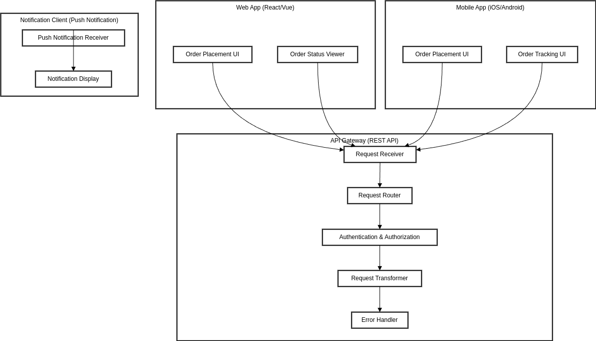

# User Ordering System Component Diagram
----

##  前端容器 Frontend

| 元件名稱 |	功能說明 |
| ----- | -------- | 
| 訂單建立元件 Order Creation Component |	提供使用者點餐介面，讓使用者選擇餐點並送出訂單 |
| 訂單狀態瀏覽元件 Order Status Viewer |	顯示訂單目前狀態及歷史訂單查詢 |
| 使用者認證元件 User Authentication Component |	管理使用者登入、登出及身份驗證 |

## API Gateway

| 元件名稱 |	功能說明 |
| ----- | -------- | 
| 請求接收元件 Request Receiver |	接收前端發出的所有API請求 |
| 請求路由元件 Request Router | 根據API路由將請求轉發至點餐系統後端服務 |
| 認證授權元件 Authentication & Authorization |	驗證使用者身份並授權存取API |
| 請求轉換元件 Request Transformer | 處理API請求資料格式轉換 |
| 錯誤處理元件 Error Handler |	統一處理API錯誤回應 |

## 點餐核心服務容器 Ordering Core Service

| 元件名稱 |	功能說明 |
| ----- | -------- | 
| 訂單管理元件 Order Management Component |	負責訂單資料的建立、更新與查詢 |
| 菜單管理元件 Menu Management Component | 管理菜單資料，包括餐點資訊及價格 |
| 支付處理元件 Payment Processor |		處理訂單付款流程與支付狀態 |

## 通知服務容器 Notification Service

| 元件名稱 |	功能說明 |
| ----- | -------- | 
| 推播通知元件 Push Notification Sender |	發送訂單狀態更新通知給使用者 |
| 簡訊通知元件 SMS Notification Sender | 透過簡訊發送訂單相關通知 |